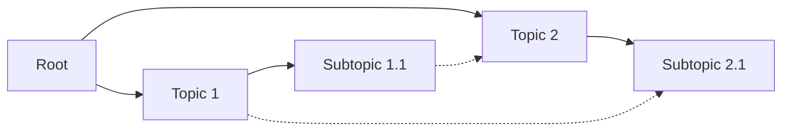

# Graph API

The Graph class provides programmatic access to graph-based topic modeling, enabling complex domain representation through networks of interconnected concepts.



!!! info "Experimental API"
    This API supports both hierarchical relationships and cross-connections between topics in different branches.

??? example "Helper function for consuming graph builds"

    ```python title="Utility function"
    import asyncio

    def consume_graph(graph):
        async def _run():
            async for _ in graph.build_async():
                pass
        asyncio.run(_run())
    ```

## Graph Configuration

Graph configuration is passed directly to the Graph constructor:

```python title="Basic graph configuration"
from deepfabric import Graph

graph = Graph(
    topic_prompt="Artificial intelligence research areas",
    model_name="anthropic/claude-sonnet-4-5",
    topic_system_prompt="You are mapping interconnected research concepts.",
    degree=4,           # Connections per node
    depth=3,            # Maximum distance from root
    temperature=0.8,    # Higher creativity for connections
    max_concurrent=4    # Limit concurrent LLM calls to avoid rate limits
)
```

### Parameters

| Parameter | Type | Description |
|-----------|------|-------------|
| `topic_prompt` | str | Central concept from which the graph expands |
| `model` | str | Model specification in `provider/model` format |
| `provider` | str | Provider name, e.g., `openai`, `anthropic` |
| `topic_system_prompt` | str | System prompt guiding hierarchical and lateral relationships |
| `degree` | int | Maximum connections per node (children + cross-connections) |
| `depth` | int | Maximum shortest-path distance from root to any node |
| `temperature` | float | Controls creativity in connection generation |
| `max_concurrent` | int | Maximum concurrent LLM calls (default: 4, range: 1-20) |

## Graph Class

The Graph class manages construction and manipulation of topic graph structures.

```python title="Complete graph workflow"
import asyncio
from deepfabric import Graph

# Create and build a graph
graph = Graph(
    topic_prompt="Artificial intelligence research areas",
    model_name="anthropic/claude-sonnet-4-5",
    degree=4,
    depth=3,
    temperature=0.8
)

async def build_graph() -> None:
    async for event in graph.build_async():
        if event["event"] == "build_complete":
            print(f"Graph built with {event['nodes_count']} nodes")

asyncio.run(build_graph())

# Access graph structure
print(f"Generated {len(graph.nodes)} nodes")

# Save and visualize
graph.save("research_graph.json")
graph.visualize("research_structure")
```

### Core Methods

#### build_async()

Constructs the complete graph structure through multi-phase generation using a generator pattern.

=== "With Progress Monitoring"

    ```python title="Monitor build progress"
    import asyncio

    async def consume_events() -> None:
        async for event in graph.build_async():
            if event['event'] == 'depth_start':
                print(f"Starting depth {event['depth']} with {event['leaf_count']} nodes")
            elif event['event'] == 'node_expanded':
                print(
                    f"Expanded '{event['node_topic']}' -> {event['subtopics_added']} subtopics,"
                    f" {event['connections_added']} connections"
                )
            elif event['event'] == 'build_complete':
                print(
                    f"Graph complete! {event['nodes_count']} nodes,"
                    f" {event.get('failed_generations', 0)} failures"
                )

    asyncio.run(consume_events())
    ```

=== "Silent Build"

    ```python title="Build without monitoring"
    async def build_silently() -> None:
        async for _ in graph.build_async():
            pass

    asyncio.run(build_silently())
    ```

**Yields**: Progress events with the following types:

| Event Type | Description |
|------------|-------------|
| `depth_start` | Beginning depth level processing |
| `node_expanded` | Node expansion completed |
| `depth_complete` | Depth level finished |
| `build_complete` | Graph construction finished |
| `error` | Build error occurred |

!!! info "Build Process"
    The build process includes hierarchical construction followed by cross-connection analysis.

#### save(filepath: str)

Persists graph structure in JSON format preserving nodes, edges, and metadata:

```python title="Save graph"
graph.save("domain_graph.json")
```

??? example "Output format"

    ```json
    {
      "nodes": {
        "node_id": {
          "prompt": "Node topic",
          "children": ["child1", "child2"],
          "connections": ["related_node"],
          "depth": 2
        }
      },
      "edges": [
        {"from": "parent", "to": "child", "type": "hierarchical"},
        {"from": "node1", "to": "node2", "type": "cross_connection"}
      ]
    }
    ```

#### from_json(filepath: str, params: dict)

Class method for loading graphs with configuration:

```python title="Load from JSON"
graph = Graph.from_json(
    "saved_graph.json",
    {
        "topic_prompt": "Research areas",
        "model_name": "anthropic/claude-sonnet-4-5"
    }
)
```

#### visualize(output_path: str)

Generates SVG visualization of the graph structure:

```python title="Visualize graph"
graph.visualize("analysis/domain_map")
```

!!! info "Output"
    Creates `domain_map.svg` showing nodes, hierarchical relationships, and cross-connections with distinct visual styling.

### Graph Analysis

Access structural information through available methods:

```python title="Analysis methods"
# Basic statistics
node_count = len(graph.nodes)
edge_count = len(graph.edges)

# Connection analysis
hierarchical_edges = [e for e in graph.edges if e["type"] == "hierarchical"]
cross_connections = [e for e in graph.edges if e["type"] == "cross_connection"]

# Get all paths from root to leaves
all_paths = graph.get_all_paths()

# Check for cycles
has_cycle = graph.has_cycle()
```

## Integration with Dataset Generation

Graphs integrate seamlessly with dataset generation:

```python title="Graph to dataset"
import asyncio

# Generate dataset from graph
generator = DataSetGenerator(
    instructions="Create interconnected explanations",
    provider="anthropic",
    model_name="claude-sonnet-4-5",
    temperature=0.7
)

dataset = asyncio.run(generator.create_data_async(
    topic_model=graph,
    num_steps=150,
    batch_size=5
))
```

## Error Handling

Graph-specific error handling:

```python title="Exception handling"
from deepfabric import GraphError

try:
    consume_graph(graph)
except GraphError as e:
    print(f"Graph construction failed: {e}")
```

## Performance Considerations

!!! warning "Computational Intensity"
    Graph construction is more computationally intensive than tree generation. Use the `max_concurrent` parameter to control the rate of LLM calls.

```python title="Rate limit control"
graph = Graph(
    topic_prompt="Complex domain",
    model_name="anthropic/claude-sonnet-4-5",
    degree=4,
    depth=3,
    max_concurrent=2  # Reduce concurrent calls to avoid rate limits
)
```

!!! tip "Scaling Considerations"
    Graph complexity scales with node count during connection analysis, making parameter selection important for large-scale generation.