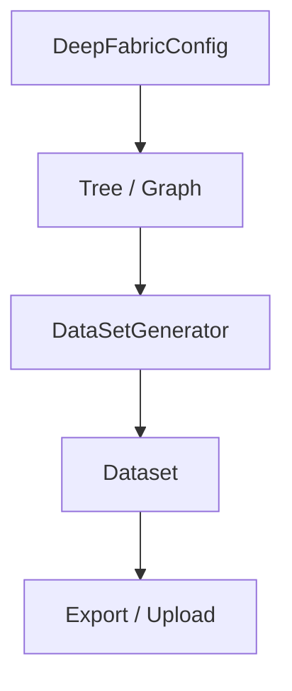

# API Reference

The DeepFabric Python API provides programmatic access to all synthetic data generation capabilities.

## Core Architecture



DeepFabric's API centers around four primary classes:

| Class | Purpose |
|-------|---------|
| **Tree / Graph** | Topic modeling through hierarchical or graph-based approaches |
| **DataSetGenerator** | Converts topics into training examples |
| **Dataset** | Manages collections with validation and export |
| **DeepFabricConfig** | YAML configuration loading and management |

## Import Patterns

```python title="Standard imports"
from deepfabric import (
    Tree, Graph, DataSetGenerator,
    DeepFabricConfig
)
```

## Configuration Management

=== "From YAML"

    ```python title="Load from file"
    config = DeepFabricConfig.from_yaml("config.yaml")
    ```

=== "Programmatic"

    ```python title="Direct configuration"
    tree = Tree(
        topic_prompt="Machine Learning Concepts",
        model_name="openai/gpt-4",
        degree=4,
        depth=3,
        temperature=0.7
    )
    ```

## Basic Generation Pattern

```python title="Standard generation workflow"
import asyncio

# 1. Create topic model
tree = Tree(
    topic_prompt="Machine Learning Concepts",
    model_name="openai/gpt-4",
    degree=4,
    depth=3,
    temperature=0.7
)

async def build_tree() -> None:
    async for _ in tree.build_async():
        pass

asyncio.run(build_tree())

# 2. Create dataset generator
generator = DataSetGenerator(
    instructions="Create detailed explanations with practical examples.",
    model_name="openai/gpt-4",
    temperature=0.8
)

# 3. Generate dataset
dataset = asyncio.run(generator.create_data_async(
    num_steps=100,
    batch_size=5,
    topic_model=tree
))

# 4. Save results
dataset.save("output.jsonl")
```

## Advanced Usage Patterns

!!! info "Iterative Development"
    Build topic structures incrementally and test dataset generation with subsets before scaling to full production.

!!! info "Multi-Provider Workflows"
    Enable different components to use optimized model providers, balancing cost, speed, and quality requirements.

!!! info "Custom Validation"
    Support application-specific quality control through custom dataset filtering and analysis.

## Error Handling

```python title="Exception handling"
from deepfabric import (
    DeepFabricError, ConfigurationError,
    ModelError, ValidationError
)

try:
    dataset = asyncio.run(generator.create_data_async(topic_model=tree))
except ModelError as e:
    # Handle API or model-specific issues
    print(f"Model error: {e}")
except ValidationError as e:
    # Handle configuration or data validation issues
    print(f"Validation error: {e}")
```

## API Sections

<div class="grid cards" markdown>

-   :material-file-tree: **Tree**

    ---

    Hierarchical topic modeling API

    [:octicons-arrow-right-24: Reference](tree.md)

-   :material-graph: **Graph**

    ---

    Graph-based topic modeling API

    [:octicons-arrow-right-24: Reference](graph.md)

-   :material-database: **DataSetGenerator**

    ---

    Dataset generation and management

    [:octicons-arrow-right-24: Reference](generator.md)

-   :material-cog: **Configuration**

    ---

    Configuration loading and parameters

    [:octicons-arrow-right-24: Reference](config.md)

</div>
