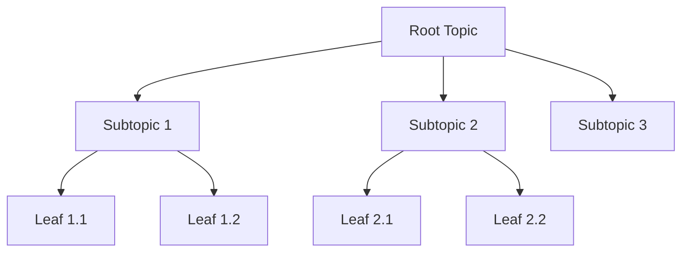

# Tree API

The Tree class provides programmatic access to hierarchical topic modeling, enabling systematic exploration of domains through structured branching from root concepts to specific subtopics.



## Tree Configuration

Configuration for tree generation is passed directly to the Tree constructor:

```python title="Basic tree configuration"
from deepfabric import Tree

tree = Tree(
    topic_prompt="Machine learning fundamentals",
    model_name="openai/gpt-4",
    topic_system_prompt="You are creating educational topic structures.",
    degree=4,         # Subtopics per node
    depth=3,          # Maximum depth
    temperature=0.7   # Generation creativity
)
```

### Parameters

| Parameter | Type | Description |
|-----------|------|-------------|
| `topic_prompt` | str | The central concept from which the tree expands |
| `model` | str | Model specification in `provider/model` format |
| `provider` | str | Provider name, e.g., `openai`, `anthropic` |
| `topic_system_prompt` | str | System prompt providing context for topic generation |
| `degree` | int | Number of subtopics generated for each node |
| `depth` | int | Maximum levels from root to leaves |
| `temperature` | float | Controls creativity in topic generation (0.0-2.0) |

## Tree Class

The Tree class handles construction, manipulation, and persistence of hierarchical topic structures.

??? example "Helper function for consuming tree builds"

    ```python title="Utility function"
    import asyncio

    def consume_tree(tree):
        async def _run():
            async for _ in tree.build_async():
                pass
        asyncio.run(_run())
    ```

```python title="Complete tree workflow"
import asyncio
from deepfabric import Tree

# Create and build a tree
tree = Tree(
    topic_prompt="Machine learning fundamentals",
    model_name="openai/gpt-4",
    degree=4,
    depth=3,
    temperature=0.7
)

async def build_tree() -> None:
    async for event in tree.build_async():
        if event["event"] == "build_complete":
            print(f"Tree built with {event['total_paths']} paths")

asyncio.run(build_tree())

# Access tree structure
print(f"Generated {len(tree.tree_paths)} topics")
for path in tree.get_all_paths():
    print(" -> ".join(path))

# Save and load
tree.save("topics.jsonl")
```

### Core Methods

#### build_async()

Constructs the complete tree structure from the root prompt using an async generator pattern.

=== "With Progress Monitoring"

    ```python title="Monitor build progress"
    import asyncio

    async def monitor_build() -> None:
        async for event in tree.build_async():
            if event['event'] == 'build_start':
                print(f"Starting build: {event['model_name']}")
            elif event['event'] == 'subtopics_generated':
                status = 'Generated' if event['success'] else 'Failed'
                print(f"{status} {event['count']} subtopics")
            elif event['event'] == 'build_complete':
                print(f"Build complete! {event['total_paths']} paths created")

    asyncio.run(monitor_build())
    ```

=== "Silent Build"

    ```python title="Build without monitoring"
    async def build_silently() -> None:
        async for _ in tree.build_async():
            pass

    asyncio.run(build_silently())
    ```

**Yields**: Progress events with the following types:

| Event Type | Description |
|------------|-------------|
| `build_start` | Build initialization |
| `subtree_start` | Beginning subtree generation |
| `subtopics_generated` | Subtopic generation result |
| `leaf_reached` | Path reached maximum depth |
| `build_complete` | Build finished |
| `error` | Build error occurred |

!!! info "Build Process"
    The build process operates level by level, generating all children for each node before proceeding to the next depth level.

#### save(filepath: str)

Persists the tree structure to JSONL format:

```python title="Save tree"
tree.save("domain_topics.jsonl")
```

Each line in the output file represents a complete path from root to leaf topic:

```json title="Output format"
{"path": ["Root", "Category", "Subtopic"]}
```

#### from_dict_list(dict_list: List[Dict])

Constructs tree from programmatically created topic lists:

```python title="Load from dict list"
topic_data = [
    {"path": ["Programming", "Python", "Data Types"]},
    {"path": ["Programming", "Python", "Control Flow"]},
    {"path": ["Programming", "JavaScript", "Functions"]}
]
tree.from_dict_list(topic_data)
```

!!! tip "External Integration"
    This method supports integration with external topic generation systems or manual topic curation.

### Tree Navigation

Access tree structure through various navigation methods:

```python title="Navigation methods"
# Get all complete paths
paths = tree.get_all_paths()

# Access specific nodes
root_node = tree.get_root()
children = tree.get_children(node_id)

# Tree statistics
depth = tree.get_max_depth()
breadth = tree.get_average_breadth()
```

## Error Handling

The Tree API provides specific exceptions for different failure modes:

```python title="Exception handling"
from deepfabric import TreeError, ModelError, ConfigurationError

try:
    consume_tree(tree)
except ModelError as e:
    print(f"Model API issue: {e}")
except ConfigurationError as e:
    print(f"Configuration problem: {e}")
except TreeError as e:
    print(f"Tree construction issue: {e}")
```

## Integration Patterns

??? example "Tree to Dataset Generation"

    ```python
    tree = Tree(
        topic_prompt="Base concept",
        model_name="openai/gpt-4",
        degree=4,
        depth=3
    )
    consume_tree(tree)

    generator = DataSetGenerator(
        instructions="Create educational content",
        model_name="openai/gpt-4"
    )
    dataset = generator.create_data(topic_model=tree, num_steps=100)
    ```

??? example "Multiple Tree Variants"

    ```python
    variants = []

    for degree in [3, 4, 5]:
        variant_tree = Tree(
            topic_prompt="Base concept",
            model_name="openai/gpt-4",
            degree=degree,
            depth=3
        )
        consume_tree(variant_tree)
        variants.append(variant_tree)

    # Tree analysis and comparison
    for i, tree in enumerate(variants):
        print(f"Variant {i}: {len(tree.get_all_paths())} topics")
    ```