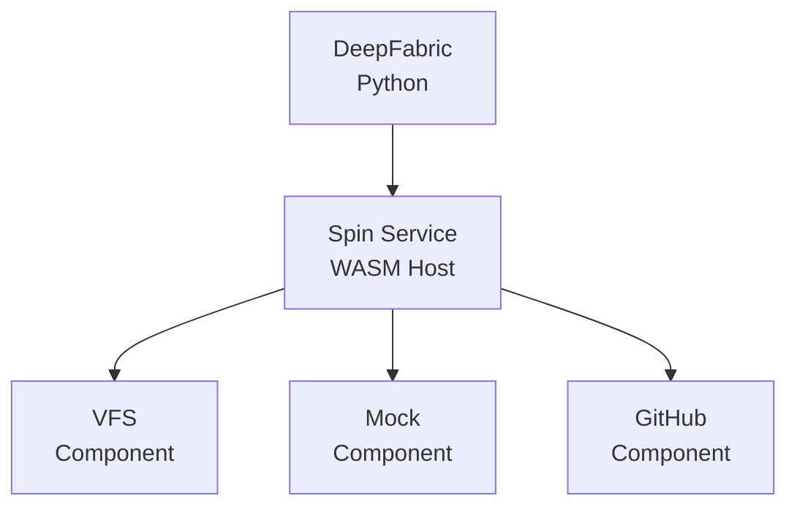

# Tools

DeepFabric uses [Spin](https://spinframework.dev), a WebAssembly framework, to execute tools during dataset generation. Tools run in isolated sandboxes, producing authentic training data based on real execution results.

## Why Real Execution Matters

Traditional synthetic data generators simulate tool outputs, which creates unrealistic training data. With Spin, tools execute against real state:

```
# Simulated (unrealistic)
Agent: read_file("config.json")
Result: {"setting": "value"}  # LLM hallucinated this

# Real execution (accurate)
Agent: read_file("config.json")
Result: FileNotFound  # Actual state
Agent: write_file("config.json", content)
Result: Written 42 bytes  # Real operation
```

## Architecture



Components are WebAssembly modules that handle specific tool categories:

| Component | Purpose | Tools |
|-----------|---------|-------|
| **VFS** | Virtual filesystem | read_file, write_file, list_files, delete_file |
| **Mock** | Dynamic mock execution | Any tool loaded via MCP |
| **GitHub** | GitHub API (experimental) | Issues, PRs, commits |

## Quick Start

### Install Spin

=== "Docker"

    We provide a prepacked Docker image:

    ```bash
    docker run -d -p 3000:3000 ghcr.io/always-further/deepfabric/tools-sdk:latest
    ```

    This will now be accessible at `http://localhost:3000`.

=== "macOS"

    ```bash
    brew install fermyon/tap/spin
    ```

=== "Linux"

    ```bash
    curl -fsSL https://developer.fermyon.com/downloads/install.sh | bash
    sudo mv spin /usr/local/bin/
    ```

=== "Local Build"

    From the `tools-sdk/` directory:

    ```bash
    spin build
    spin up
    ```

    The service runs at `http://localhost:3000`.

Configure DeepFabric to use it:

```yaml title="config.yaml"
generation:
  tools:
    spin_endpoint: "http://localhost:3000"
    components:
      builtin:  # VFS tools -> /vfs/execute
        - read_file
        - write_file
        - list_files
```

Each component routes to its own endpoint (`/{component}/execute`).

## Session Isolation

Each dataset sample gets an isolated session. Files created during one sample don't affect others:

```python
# Session A: Creates config.json
# Session B: config.json doesn't exist

# After sample generation, session is cleaned up
```

!!! info "Automatic Cleanup"
    DeepFabric automatically creates and cleans up sessions for each sample, ensuring isolation between training examples.

## Next Steps

<div class="grid cards" markdown>

-   :material-cog: **Spin Setup**

    ---

    Installation and running the tool service

    [:octicons-arrow-right-24: Setup guide](spin.md)

-   :material-folder-outline: **VFS Component**

    ---

    Virtual filesystem tools for file operations

    [:octicons-arrow-right-24: Learn more](vfs.md)

-   :material-test-tube: **Mock Component**

    ---

    Dynamic tool mocking for external APIs

    [:octicons-arrow-right-24: Configure mocks](mock.md)

-   :material-connection: **MCP Integration**

    ---

    Loading tools from MCP servers

    [:octicons-arrow-right-24: MCP setup](mcp.md)

-   :material-wrench: **Custom Tools**

    ---

    Creating your own Spin components

    [:octicons-arrow-right-24: Build tools](custom.md)

</div>
