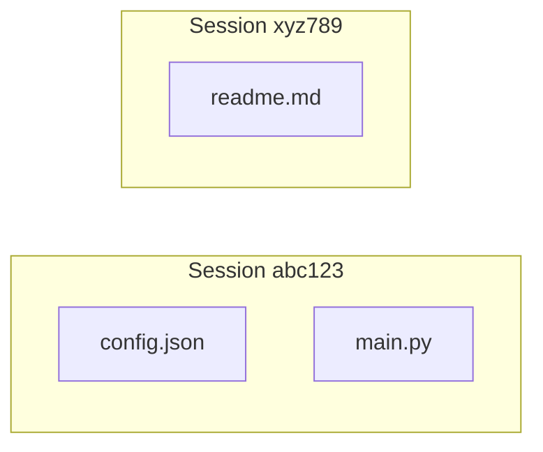
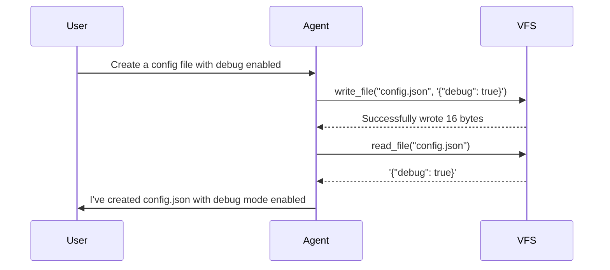

# VFS Component

The Virtual Filesystem (VFS) component provides file operations in an isolated, session-scoped environment. Each session gets its own virtual filesystem that doesn't persist across samples.

## Available Tools

| Tool | Description | Parameters |
|------|-------------|------------|
| `read_file` | Read file content | `file_path` (string) |
| `write_file` | Write to file | `file_path` (string), `content` (string) |
| `list_files` | List all files | None |
| `delete_file` | Delete a file | `file_path` (string) |

## Configuration

```yaml title="config.yaml"
generation:
  tools:
    spin_endpoint: "http://localhost:3000"
    components:
      builtin:  # Routes to /vfs/execute
        - read_file
        - write_file
        - list_files
```

!!! info "Builtin Component"
    The `builtin` component maps to VFS tools and routes to `/vfs/execute`. List specific tools or omit the list to include all builtin tools.

## Session Isolation

Files are scoped by `session_id`. This prevents cross-contamination between samples:



!!! note "Automatic Management"
    DeepFabric automatically creates and cleans up sessions for each sample.

## Seeding Initial State

Pre-populate files for scenarios:

```yaml title="config.yaml"
generation:
  tools:
    spin_endpoint: "http://localhost:3000"
    components:
      builtin:
        - read_file
        - write_file
        - list_files
    scenario_seed:
      files:
        "config.json": '{"debug": true, "port": 8080}'
        "data/users.json": '[{"id": 1, "name": "Alice"}]'
```

The agent can then read and modify these files during generation.

## API Reference

### Execute Tool

```bash title="Execute request"
POST /vfs/execute
Content-Type: application/json

{
  "session_id": "sample-001",
  "tool": "read_file",
  "args": {"file_path": "config.json"}
}
```

### Response Format

```json title="Success response"
{
  "success": true,
  "result": "{\"debug\": true}",
  "error_type": null
}
```

### Error Types

| Error | Description |
|-------|-------------|
| `FileNotFound` | File doesn't exist |
| `InvalidArguments` | Missing required parameter |
| `IOError` | Storage error |

### Cleanup Session

```bash
DELETE /vfs/session/{session_id}
```

Returns count of deleted files.

## Example Workflow



This produces training data where the agent's decisions follow real observations.
