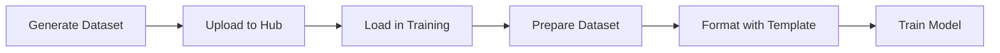

# Training

DeepFabric datasets integrate directly with popular training frameworks. This section covers loading datasets, preparing them for efficient training, formatting with chat templates, and integrating with TRL and Unsloth.

## Workflow



1. **Generate dataset** - `deepfabric generate config.yaml`
2. **Upload to Hub** - `deepfabric upload-hf dataset.jsonl --repo user/dataset`
3. **Load in training** - `load_dataset("user/dataset")`
4. **Prepare dataset** - `prepare_dataset_for_training()` (optional but recommended)
5. **Format with template** - `tokenizer.apply_chat_template()`
6. **Train** - SFTTrainer or Unsloth

## Quick Example

```python title="training_example.py"
from datasets import load_dataset
from transformers import AutoTokenizer
from trl import SFTTrainer, SFTConfig
from deepfabric.training import prepare_dataset_for_training

# Load dataset
dataset = load_dataset("your-username/my-dataset", split="train")

# Prepare dataset (reduces tool overhead for tool-calling datasets)
prepared = prepare_dataset_for_training(dataset, tool_strategy="used_only")

# Format with tokenizer
tokenizer = AutoTokenizer.from_pretrained("Qwen/Qwen2.5-7B-Instruct")

def format_sample(example):
    text = tokenizer.apply_chat_template(
        example["messages"],
        tools=example.get("tools"),
        tokenize=False,
        add_generation_prompt=False
    )
    return {"text": text}

formatted = prepared.map(format_sample)

# Train
trainer = SFTTrainer(
    model=model,
    tokenizer=tokenizer,
    train_dataset=formatted,
    args=SFTConfig(output_dir="./output"),
)
trainer.train()
```

## Key Concepts

!!! info "Chat Templates"
    Chat templates convert message arrays into model-specific formats. Each model family (Qwen, Llama, Mistral) has its own template.

!!! info "Tool Formatting"
    Tool formatting differs by model. Some models expect tools in the system message, others in a separate parameter.

!!! info "Reasoning Traces"
    Reasoning traces can be included in training or used as auxiliary data.

!!! info "Training Callbacks"
    Training callbacks integrate with the training loop for logging, early stopping, and custom behavior.

## Next Steps

<div class="grid cards" markdown>

-   :material-download: **Loading Datasets**

    ---

    HuggingFace integration and data management

    [:octicons-arrow-right-24: Learn more](loading.md)

-   :material-tune: **Dataset Preparation**

    ---

    Optimizing datasets for efficient training

    [:octicons-arrow-right-24: Optimize](dataset-preparation.md)

-   :material-format-text: **Chat Templates**

    ---

    Formatting for different model architectures

    [:octicons-arrow-right-24: Configure](chat-templates.md)

-   :material-school: **Training Frameworks**

    ---

    TRL, Unsloth, SFTConfig, and callbacks

    [:octicons-arrow-right-24: Train](frameworks.md)

</div>
